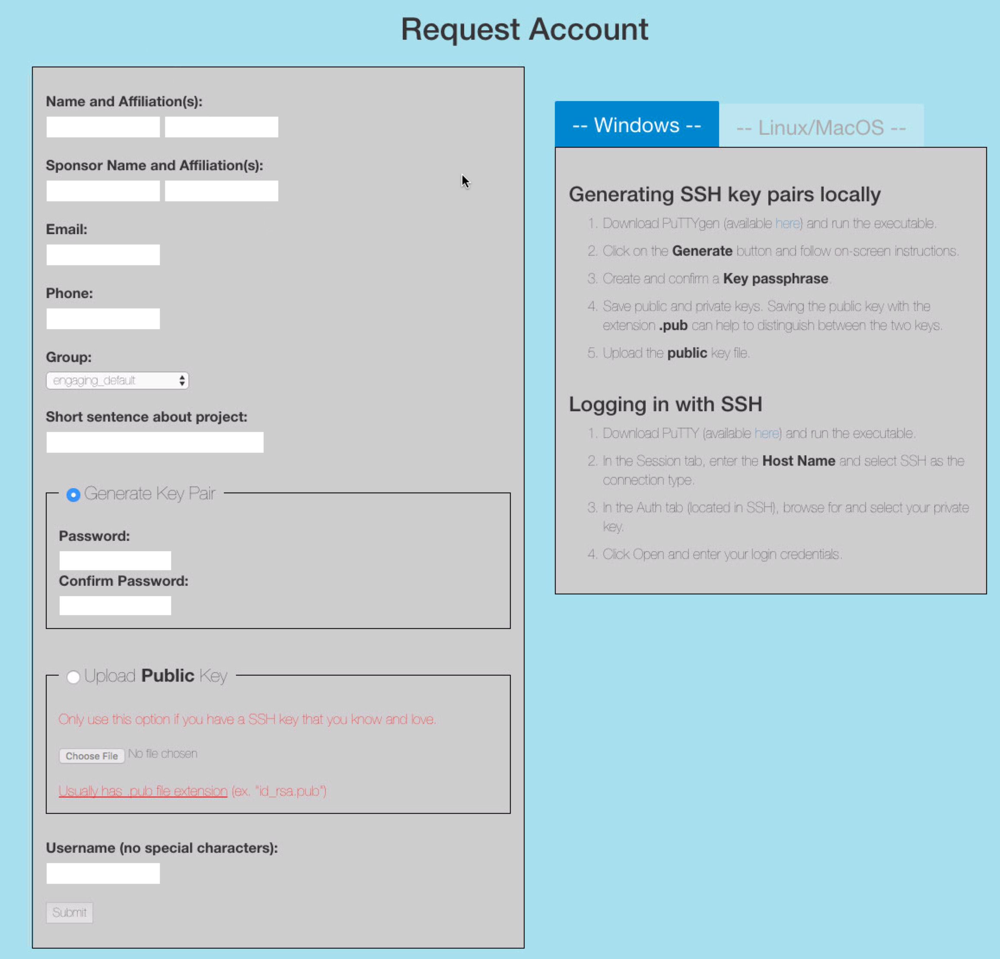
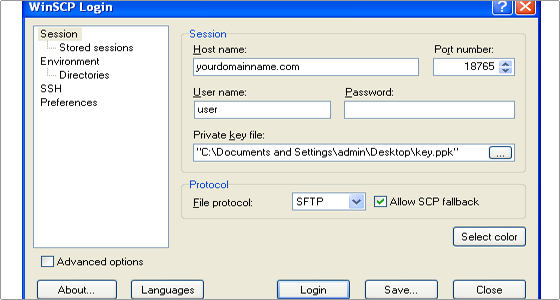
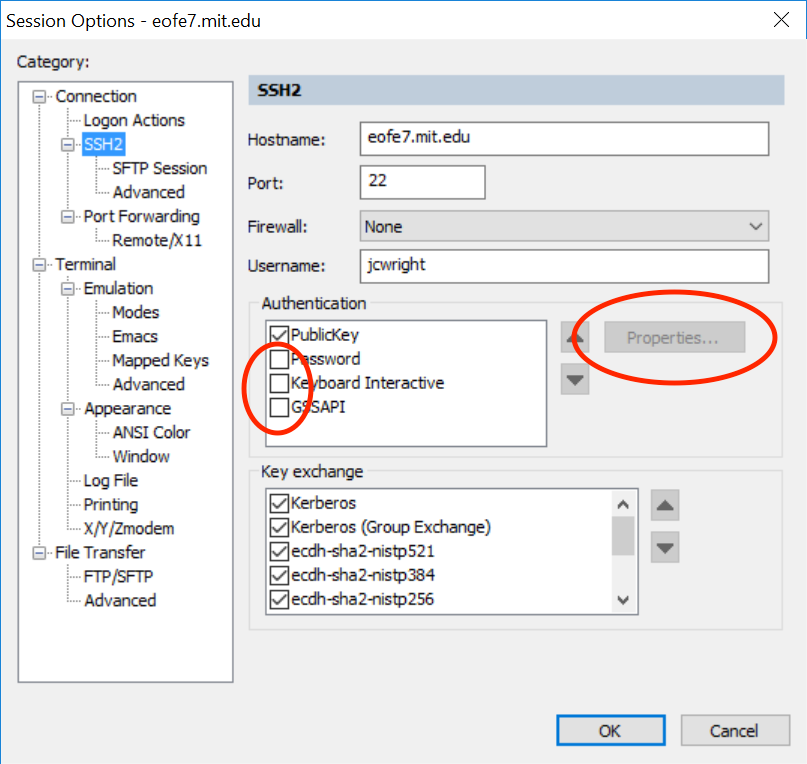
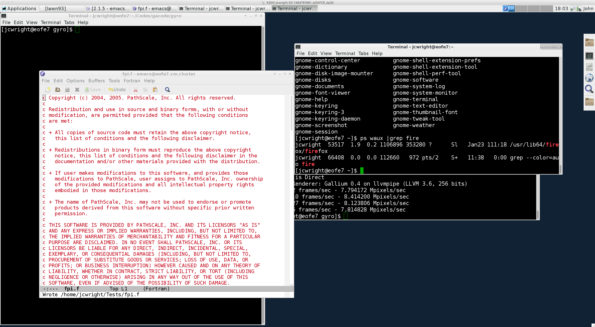

# engaging_cluster_howto
A brief introduction to the engaging cluster for the NSE and PSFC groups. Assorted recipes and gists.

# Abstract


The Massachusetts Green Energy High Performance Computing Center
(MGHPCC) in Holyoke, MA is 100 miles from MIT campus connected
by formerly dark fiber (10Gb). Completed in November 2012, the 90, 000 square
foot, 15 megawatt facility is located on an 8.6 acre former
industrial site just a few blocks from City Hall. University
partners include B.U., NorthEaster, Harvard, UMass and MIT.

The engaging computer cluster is a large (~500 nodes)
multi-departmental compute cluster in the MGHPCC facility. NSE
and the PSFC together have 136 nodes in the cluster. We will
discuss the MGHPCC and how it came to be, what it provides and
what resources are available to members of the NSE and PSFC
programs. The presentation will be followed by a live demo of
the basic tasks involved in using the new subsystem. Topics
covered including how to log in, how to bring up remote
applications, using git, compiling, runnning jobs in the batch
system.

  These slides, related source code and recipes may be found at
  github repository https://github.com/jcwright77/engaging_cluster_howto.git 

The author may be contacted at `jcwright@mit.edu`.

Administrative questions should be directect to `engaging-admin@techsquare.com`

# The engaging system and the nse and psfc nodes

-   100+32+4 nodes, 4352 cores
    Centos 7 , 2x16 cores Intel Xeon 2.1 GHz, 128 GB RAM
-   Nodes available in the `sched_any_quicktest` partition
    Centos 6 ,2x8 cores Intel Xeon 2.0 GHz, 64 GB RAM
-   The remaining system nodes run Centos 6 and have 16 cores per node.


# Getting an account

Account access is via ssh keys. You may provide your own or use
an ssh key pair generated for you. To request and account, 

visit <https://eofe1.mit.edu/request_account>

select mit\_nse, mit\_emilio\_b, or mit\_psfc group as appropriate. Follow instructions to get or specify
your ssh public key.

# Logging in.

-   ssh (all): ssh is included in linux and osx distributions. 
    
    It is available in the bash shell under Windows 10 after
    enabling WSL, but in beta and seems to only support DSS(.dsa)
    keys presently (engaging issues rsa keys). 
    
    You can do X11 forwarding for remote GUI usage. X11 usage requires
    XQuartz under OSX or [X-Win32](http://kb.mit.edu/confluence/pages/viewpage.action?pageId%3D148603332) under Windows.

-   **[SecureCRT](http://kb.mit.edu/confluence/display/istcontrib/SecureCRT%2B%2Band%2BSecureFX%2B%2Bfor%2BWindows%2B-%2BInstallation%2BInstructions) (windows):** Windows ssh terminal with port forwarding

-   **[x2go](http://wiki.x2go.org/doku.php) (all):** remote desktop access

-   **[putty](www.putty.org):** ssh terminal program for windows. Requires transformation of your private key to a `PPK` format using the puttygen program.

-   **[XWIN32](http://www.starnet.com/xwin32/):** X11 emulator that also supports ssh connections
    Uses same `ppk` format for keys as putty.
    See IS&T for the[ license key](https://downloads.mit.edu/released/xwin32/xwin32-2014/xwin32-2014readme2016.txt). 
    Make sure that you get release 53 required for working ssh key
    support. IS&T is currently providing release 47. You
    can get the latest release from the [vendor](http://www.starnet.com/xwin32/).

# What is an ssh key?

- similar to your MIT certificates but you have two parts.
   + public key part : eg `id_rsa_user.pub`. Linux permissions `chmod 700 id_rsa_user.pub` in `$HOME/.ssh` directory
   
     This is the key that needs to be on the destination machine. engaging signup does this for you.
     
   + private key part : eg `id_rsa_user`.Linux permissions `chmod 600 id_rsa_user` in `$HOME/.ssh` directory
      
     This is the key you need on your local machine. On linux in your .ssh directory or specified directly with `ssh -i`. For gui interfaces on windows, this is the key your provide when setting up a session or preparing a key for putty with puttygen. The private key also includes enough information to generate its matching public key. The converse, of course, computationally prohibitive.
   
     For the truly interested, ssh keys use [public key cryptography](https://en.wikipedia.org/wiki/Public-key_cryptography). The basic process is that a message is encrypted with your private key and sent along with other details such as key type, public key and username to the `sshd` server. The server checks for a matching public key in the user's `authorized_keys` file. This public key is used to decrypt the message and if it matches the expected message (including username among other items) then the connect is accepted. Traffic over the connect is also encrypted with the key pair. The public key is actually like a lock shared with someone else to which you keep the key(the private key). This operations works and is asymmetric because the encryption process uses knowledge of the two primes composing a product whereas the decryption process only requires knowing a value that is coprime to the product, this product is available to both the public and private keys (sorry TMI?).
   
# Working with the file system

-   nfs storage. Long term inexpensive storage, expandable.
    -   Group specific, eg:
        
        `/net/eofdata-data005/psfclab001/<username>` 50 TB
        
        This volume is automounted so you have to `cd` into it
        explicitly to see it.
    -   other storage can be used in serial runs :  1TB quota
        
        `/pool001/`

-   home directory. Backed up with TSM at MIT.
    
    `/home/<username>` 100 GB quota

-   parallel filesystem.  Run your parallel codes here. Note the
    name. 
    
    lustre : /nobackup1/<username> . 1 PetaByte of storage for engaging
    
-   file transfers
    -   scp ('nix) : `scp localfile.txt <username>@eofe7.mit.edu:local/relative/path`
    
    -   sftp ('nix) : `sftp <username>@eofe7.mit.edu` to get prompt.
    
                      `sftp> ?` to get help. `put localfile`
    
    -   sshfs ('nix) : `sshfs <username>@eofe7.mit.edu local_empty_dir:`
            Creates a link to remote files in to an local empty folder. After the command, your remote files are accessible for 
            editting or copying to with normal local file operations (eg `cp`, `mv`, viewing and editting)
    
    -   winSCP (windows) : specify your key for your engaging connection in `SSH > Authentication page` of advanced setup. Uses `.ppk` putty key format. Generate a `ppk` format key from your private ssh key with [PuttyGen](https://winscp.net/eng/docs/ui_puttygen).
    
    
    - SecureCRT (windows) : **Recommended.** supports file transfers with a session. type `rz <RETURN>` to bring up a dialog to upload files. Can also drag-and-drop! Select Z-modem transfer in both cases. `sz <args>` to transfer files from engaging to your desktop.
       
       
# Other methods (not recommended at this time)
    
    -   cifs (windows): Not available at this time. possible but not up as a service. brings in
        username and domain mapping issues.
    
    -   x2go (all platforms): Not recommended at this time for file transfers. buggy, requires `fuse` group membership on server.
    
    -   bash under windows (WSL available with windows 10): for power users,
        enables scp, sshfs. Requires activation of developer mode.

# Finding software with Environment Modules

Provide a clean way of managing multiple compiler/MPI
combinations, software versions and dependencies. Modules modify
search paths and other environmental variables in a user's
shell so the executables and libraries associated with a
module are found.
-   **`module avail`:** list all modules currently available on the system
-   **`module show`:** show what environment a module loads
-   **`module add/unload`:** add/remove a module from a user's environment
-   **`module list`:** list what modules are loaded
-   **`module purge`:** remove all loaded modules
-   **`module use =path=`:** add a new search path to modules

Module names follow a convention of `software/version`
```
[jcwright@eofe7 ~]$ module use /home/software/psfc/modulefiles/
[jcwright@eofe7 ~]$ module avail

---------------------------------- /home/software/psfc/modulefiles/ ------------------------------------
psfc/atlas/gcc-4.8.4/3.10.3      psfc/fftw/2.1.5        psfc/fftw/3.3.5       psfc/totalview/2016.07.22
---------------------------------- /home/software/modulefiles ------------------------------------------
foo/1.0       gcc/4.9.4     gcc/5.4.0     gcc/6.2.0     intel/2017-01 R/3.3.1

...
```
A research group can create their own set of modules and
expose them to users with `module use`. On engaging, these are located
in `/home/software/<group>/` eg `/home/software/psfc/`. This can also be done in a
user's own home directory for managing different builds of your own software or local installs.

# Running jobs in SLURM [gist](https://gist.github.com/jcwright77/4c64088a67868ef2ecf31319898f0730)

-   SLURM
    
    The Simple LinUx Resource Manager (SLURM) is
    used on engaging to manage job submissions. If you used the NERSC systems you will be
    familiar with it.
    
-   Partitions 
    
    Partitions are what job queues are called in
    SLURM. The partitions for the NSE and the PSFC are: 
    - `sched_mit_psfc`
    - `sched_mit_nse`
    - `sched_mit_emiliob`

-   Common slurm commands
    - sbatch :: submit a batch job
    - squeue -u username :: show a users job status
    - scancel  :: kill a job
    
    - scontrol show partition :: list partitions to which you have access
    - scontrol show jobid `#` :: info on job
    - sinfo -a :: show all partition names, runtimes and available nodes
    - salloc :: request a set of nodes in a partition
      `salloc --gres=gpu:1 -N 1 -n 16 -p sched_system_all --time=1:00:00 --exclusive`
    - srun :: obtain a job allocation
    - sacct :: detailed information on usage

    
    Lots more info 

- Recipes
  -   Getting an interactive job, one node
    
        `srun -p sb.q -I -N 1 -c 1 --pty -t 0-00:05 /bin/bash`
        where `sb.q` is the partition you want to use. Note quicktest has a 15min limit.
  -   Request 16 cores on a node
        `salloc -N 1 -n 16 -p sched_any_quicktest --time=0:15:00 --exclusive`
        
  -   Request a specific node, 32 cores, and forward X11 for remote display
        #x11 forwarding to a specific node, may take a moment to first load
        `srun -w node552 -N 1 -n 32 -p sched_mit_nse --time=1:00:00 --x11=first --pty /bin/bash`
  - How much memory is or did my job use
         `sacct -o MaxRSS -j JOBID`
        
        

#   Example Script
```
#!/bin/bash
# submit with sbatch cpi_nse.slurm
# commandline arguments may instead by supplied with #SBATCH <flag> <value>
# commandline arguments override these values

# Number of nodes
#SBATCH -N 32
# Number of processor core (32*32=1024, psfc, mit and emiliob nodes have 32 cores per node)
#SBATCH -n 1024
# specify how long your job needs. Be HONEST, it affects how long the job may wait for its turn.
#SBATCH --time=0:04:00
# which partition or queue the jobs runs in
#SBATCH -p sched_mit_nse
#customize the name of the stderr/stdout file. %j is the job number
#SBATCH -o cpi_nse-%j.out

#load default system modules
. /etc/profile.d/modules.sh

#load modules your job depends on. 
#better here than in your $HOME/.bashrc to make debugging and requirements easier to track.
#here we are using gcc under MPI mpich
module load mpich/ge/gcc/64/3.1

#I like to echo the running environment
env

#Finally, the command to execute. 
#The job starts in the directory it was submitted from.
#Note that mpirun knows from SLURM how many processor we have
#In this case, we use all processes.

mpirun ./cpi
```

# Other slurm scripts
   - Serial jobs. Specificy one node and one core. No need for `mpirun` commmand. May specify memory requirement with `#SBATCH --mem X` to ensure sufficient memory for large jobs.
   
```sh
#!/bin/bash
#SBATCH -N 1
#SBATCH -n 1
#SBATCH --mem 10000  #in MB
#SBATCH --time=0:04:00
#SBATCH -p sched_mit_psfc
#SBATCH -o myjob-%j.out

. /etc/profile.d/modules.sh

./pi_serial
```

#   How to compile. Sourcecode [gist](https://gist.github.com/jcwright77/a5e1d66886bc17b0f7936466739cc287).
  - On engaging there are two main compilers supported, `gcc/gfortan (4.9.4, 5.4.0, 6.2.0)` and `intel  17`.
  - to compile, you would load either gcc or intel modules. Optionally load the associated `MPI` library if compiling parallel programs. Using the mpi compiler command (`mpiifort, mpiicc, mpicc`, etc) automatically links in the required `MPI` libraries.
  - fortran
    ```sh
    module load intel
    module load impi #for parallel support
    ifort -o myprog myprog.f/f90/F90/F
    #or if parallel
    mpiifort -o my_par_program my_par_prog.f/f90/F90/F
    ```
    
  - C
    ```sh
    module load gcc
    module load  mpich/ge/gcc/64/3.1 # for parallel support
    gcc -o myprog myprog.c
    mpicc -o myprog myprog.c/cc #for parallel compilation
    ```
    
#   Other trivia
  -   you can only ssh to a node if you have a job using it.
    
  -   web pages in `$HOME/public\_html` appear as http://engaging-web.mit.edu/~theuser

# Demos

-   Log in using x2go
    Uses ssh key and passphrase
-   Retrieve demo script and program sources from github, edit and run it.
    Uses git, vim or emacs or gedit, slurm batch system, c and
    fortran compilers. [gist](https://gist.github.com/jcwright77/a5e1d66886bc17b0f7936466739cc287)
-   matlab
-   Dropbox
-   julia

The following are not yet present explicitly in the slide deck.
-   python demo
-   parallel task farm
    slurm job arrays, multiplexing across nodes (queues)
-   slurm, restarting for long jobs
-   slurm reservations


# Log in using x2go
x2go uses your ssh keys to give you a remote desktop on the engaging cluster. This desktop is also persistent so you close a session and return to it later, even on another device.
 

# Running a serial and then parallel program from github

# matlab example
```
module load mit/matlab
matlab #for gui
matlab -nodesktop -nosplash # for commandline
matlab -nodesktop -nosplash -nodisplay -r "run('/home/user/rest/of/path/mfile.m');" # for a non-interactive process, eg a batch script
```

# julia parallel example
[Julia](julialang.org) is a parallel interpreted language developed at MIT.
```
#load julia
module load engaging/julia

#request a node
srun -N 1 -n 32 -p sched_mit_nse --time=1:00:00 --x11=first --pty /bin/bash

#start julia
julia -j 4
julia> nprocs()
5
julia> workers()                           # Identifiers for the worker processes.
4-element Array{Int64,1}:
 2
 3
 4
 5
@everywhere println(@sprintf("ID %d: %f %d", myid(), rand(), p))
ID 1: 0.686332 5
	From worker 4:	ID 4: 0.107924 5
	From worker 5:	ID 5: 0.136019 5
	From worker 2:	ID 2: 0.145561 5
	From worker 3:	ID 3: 0.670885 5
```


# Dropbox example
  You can open your dropbox account directly in a web browser on engaging in x2go.
  
  For commandline access, this requires creating a Dropbox app following these [instructions](http://xmodulo.com/access-dropbox-command-line-linux.html). With this program you can download and upload specific files or folders and list contents of folders but it does not auto-sync.
  
  Alternatively, you can install the Dropbox daemon program and run it in your account to synchronize a local folder. Instructions are at the [dropbox wiki](http://www.dropboxwiki.com/tips-and-tricks/install-dropbox-in-an-entirely-text-based-linux-environment).
  

# More info

-   gists of examples in these demos and other recipes in this public gists space: https://gist.github.com/jcwright77
    - [PI serial and parallel programs](https://gist.github.com/jcwright77/a5e1d66886bc17b0f7936466739cc287)
    - [example slurm batch job](https://gist.github.com/jcwright77/4c64088a67868ef2ecf31319898f0730)
-   sloan engaging documentation at [<https://wikis.mit.edu/confluence/display/sloanrc/Engaging+Platform>](https://wikis.mit.edu/confluence/display/sloanrc/Engaging%2BPlatform)
    requires MIT certificates. Info on engaging usage in general
    as well as custom Sloan tools and modules.
-   PSFC engaging info and local account request <http://computers.psfc.mit.edu/cluster>
-   Harvard info on a similar system at MGHPCC https://rc.fas.harvard.edu/resources/running-jobs/
